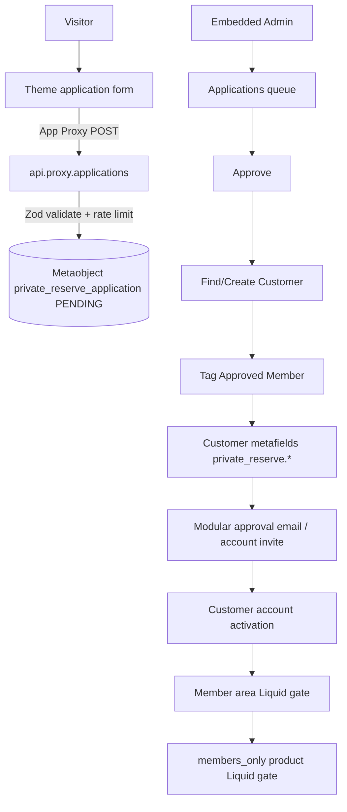

# XM Private Reserve — Architecture

## Overview

Option C: **Shopify-native membership system**. Applications live in Metaobjects. Approved members are Shopify Customers. No PostgreSQL / MySQL / Mongo application database. SQLite `Session` is used only for OAuth.



## Data model

### Metaobject `private_reserve_application`

| Field | Purpose |
|---|---|
| application_number | XM-000001 |
| full_name, email, membership_type | Core applicant |
| Referral free-text fields | Stored from existing form |
| referring_customer_id / referring_member_number | Best-effort link on approve |
| status | PENDING → … → APPROVED / REJECTED / WAITLISTED |
| shopify_customer_id, member_number | Set on approve |
| approval_email_sent_at | Duplicate email protection |
| admin_notes | Append-only audit |

### Customer metafields `private_reserve.*`

membership_status, membership_type, member_number, application_number, application_id, approved_at, joined_at, **referral_code** (defaults to member number; future custom codes without form changes).

### Product metafield `private_reserve.members_only` (boolean)

When `true`, theme Liquid hides Add to Cart unless the customer has tag **Approved Member**.

## Scopes

```
read_metaobjects, write_metaobjects,
read_metaobject_definitions, write_metaobject_definitions,
read_customers, write_customers,
read_products, write_products
```

## Security summary

| Area | Control |
|---|---|
| Admin | `authenticate.admin` (Shopify session / App Bridge) |
| Storefront create | App Proxy signature + Zod + in-process rate limit |
| Privileged fields | Not in storefront schema; status forced PENDING |
| Passwords | Never collected; Shopify account invite / login |
| Member content | Liquid `customer.tags contains 'Approved Member'` |
| Member products | Liquid + `members_only` metafield (UI gate) |
| Secrets | Env only; no hardcoded credentials |

### Known Shopify limitations

1. **Liquid cannot alone block Cart AJAX / Storefront API** variant adds. PDP purchase form is hidden, but a determined client could POST `/cart/add.js` with a variant ID. Stronger options: Shopify Plus checkout validation, Functions / cart transform, Markets/B2B catalogs.
2. **In-process rate limiting** resets on server restart / multi-instance deploys. Prefer Shopify / edge WAF for production abuse protection.
3. **Referral association** is best-effort (name or member number match). Ambiguous names may not link.
4. **Default `product.json`** (Dawn main-product) is not XM-gated — use XM product templates or set `members_only` on products that use XM purchase sections.
5. Removing the **Approved Member** tag immediately revokes Liquid-gated content (fail closed).

## Performance notes

- App Proxy no longer re-syncs definitions on every submit (ensure on app load / Settings).
- Members list loads tagged customers in capped pages, then filters/sorts in memory (appropriate for club-scale membership).
- Theme CSS/JS scoped to XM sections; member checks are Liquid-only (no JS access control).

## Accessibility notes

- Purchase gate region has `aria-label`.
- Quantity controls retain visually-hidden labels.
- Form error region uses `role="alert"`.
- Member nav and gates use semantic headings / links; focus follows native controls.

## Deployment

1. `cd xm-private-reserve && npm install && npx prisma migrate deploy`
2. Update scopes (`read_products,write_products`) — re-auth store after `shopify app dev` / deploy
3. Open **Settings → Ensure definitions** (Metaobject fields + customer + product metafields)
4. Push theme; create page `private-reserve-members` with template `private-reserve-members`
5. Enable Customer accounts (Optional or Required)
6. On member products: set metafield **Members only** = true; assign XM product template

## Future improvements

- Custom referral codes (write `referral_code`; optional prefill without new form fields)
- Shopify Plus checkout lock for `members_only`
- Resend/SMTP email provider behind `EMAIL_PROVIDER`
- CAPTCHA / Turnstile on application proxy
- Member revoke / tag-removal admin action
